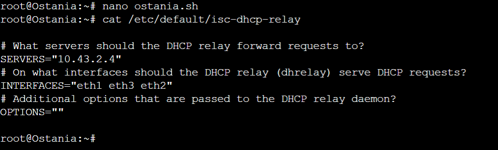
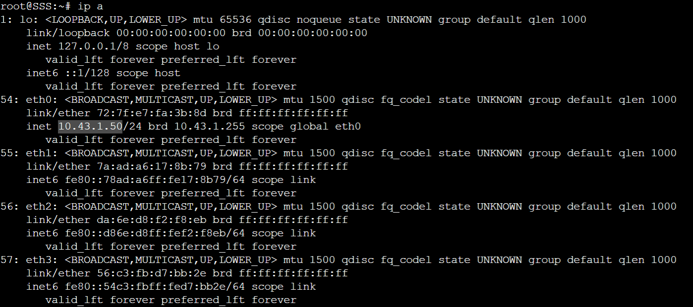

# Jarkom-Modul-3-ITA07-2022

## Laporan Hasil Praktikum Modul 3 Kelompok ITA07

Anggota kelompok: 

| Ariel Daffansyah Aliski | 5027201058 |
| --- | --- |
| Anak Agung Bintang Krisna Dewi | 5027201060 |
| Naftali Salsabila Kanaya Putri | 5027201012 |

# Daftar isi

## Soal Nomor 1

Loid bersama Franky berencana membuat peta tersebut dengan kriteria **WISE** sebagai DNS Server, **Westalis** sebagai DHCP Server, **Berlint** sebagai Proxy Server

**Jawaban untuk Soal Nomor 1 akan dijawab bersamaan dengan Nomor 2**

## Soal Nomor 2

**Ostania** sebagai DHCP Relay

Agar semua node bisa terhubung internet maka semua node harus diatur nameservernya pada `etc/resolv.conf`

```bash
nameserver 192.168.122.1
```

Sebab **WISE** akan digunakan sebagai DNS server, maka kita harus mengunduh service `bind9`

```bash
echo "nameserver 192.168.122.1" > /etc/resolv.conf
apt-get update
apt-get install bind9 -y
```

****************Westalis**************** akan digunakan sebagai DHCP server, sehingga perlu mengunduh `isc-dhcp-server`

```bash
echo "nameserver 192.168.122.1" > /etc/resolv.conf
apt-get update
apt-get install isc-dhcp-server -y
```

****************Berlint**************** akan digunakan sebagai proxy sehingga perlu menginstall `Squid`

```bash
echo "nameserver 192.168.122.1" > /etc/resolv.conf
apt-get update
apt-get install libapache2-mod-php7.0 -y
apt-get install squid -y
```

**************************Ostania************************** akan digunakan sebagai DHCP relay, sehingga perlu diinstall `isc-dhcp-relay` 

```bash
echo "nameserver 192.168.122.1" > etc/resolv.conf
apt-get update
apt-get install isc-dhcp-relay -y
```

Topologi yang digunakan adalah sebagai berikut


Dan untuk konfigurasi masing masing nodenya adalah sebagai berikut

**************Ostania**************

```bash
auto eth0
 iface eth0 inet dhcp

auto eth1
iface eth1 inet static
	address 10.43.1.1
	netmask 255.255.255.0

auto eth2
iface eth2 inet static
	address 10.43.2.1
	netmask 255.255.255.0

auto eth3
iface eth3 inet static
	address 10.43.3.1
	netmask 255.255.255.0
```

********WISE********

```bash
auto eth0
iface eth0 inet static
	address 10.43.2.2
	netmask 255.255.255.0
	gateway 10.43.2.1
```

**************Berlint**************

```bash
auto eth0
iface eth0 inet static
	address 10.43.2.3
	netmask 255.255.255.0
	gateway 10.43.2.1
```

****************Westalis****************

```bash
auto eth0
iface eth0 inet static
	address 10.43.2.4
	netmask 255.255.255.0
	gateway 10.43.2.1
```

Pada file /etc/default/isc-dhcp-relay di Ostania dikonfigurasi seperti berikut

```bash
# What servers should the DHCP relay forward requests to?
SERVERS="10.43.2.4"

# On what interfaces should the DHCP relay (dhrelay) serve DHCP requests?
INTERFACES="eth1 eth3 eth2"

# Additional options that are passed to the DHCP relay daemon?
OPTIONS=""
```

Setelah itu start dhcp
```bash
service isc-dhcp-relay start
```



## Soal Nomor 3

Loid dan Franky menyusun peta tersebut dengan hati-hati dan teliti. Ada beberapa kriteria yang ingin dibuat oleh Loid dan Franky, yaitu:
1. Semua client yang ada HARUS menggunakan konfigurasi IP dari DHCP Server.
2. Client yang melalui Switch1 mendapatkan range IP dari [prefix IP].1.50 - [prefix IP].1.88 dan [prefix IP].1.120 - [prefix IP].1.155

**Prefix Kelompok kami adalah `10.43` sehingga soal disesuaikan dengan prefix kami**

Konfigurasikan rentang ip pada folder /etc/dhcp/dhcpd.conf lalu restart DHCP servernya `service isc-dhcp-server restart`

```bash
subnet 10.43.1.0 netmask 255.255.255.0 {
        range 10.43.1.50 10.43.1.88;
        range 10.43.1.120 10.43.1.155;
        option routers 10.43.1.1;
        option broadcast-address 10.43.1.255;
        option domain-name-servers 10.43.2.2;
}

subnet 10.40.2.0 netmask 255.255.255.0 {}
```

**Testing**
Mengetes salah satu IP dari client yang melalui Switch1


## Soal Nomor 4

Client yang melalui Switch3 mendapatkan range IP dari [prefix IP].3.10 - [prefix IP].3.30 dan [prefix IP].3.60 - [prefix IP].3.85

**Prefix Kelompok kami adalah `10.43` sehingga soal disesuaikan dengan prefix kami**

Konfigurasikan kembali rentang ipnya pada /etc/dhcp/dhcpd.conf

```bash
subnet 10.43.1.0 netmask 255.255.255.0 {
        range 10.43.1.50 10.43.1.88;
        range 10.43.1.120 10.43.1.155;
        option routers 10.43.1.1;
        option broadcast-address 10.43.1.255;
        option domain-name-servers 10.43.2.2;
        default-lease-time 300;
        max-lease-time 6900;
}
subnet 10.43.2.0 netmask 255.255.255.0{
}
subnet 10.43.3.0 netmask 255.255.255.0 {
        range 10.43.3.10 10.43.3.30;
        range 10.43.3.60 10.43.3.85;
        option routers 10.43.3.1;
        option broadcast-address 10.43.3.255;
        option domain-name-servers 10.43.2.2;
        default-lease-time 600;
        max-lease-time 6900;
}
```

## Soal Nomor 5

Client mendapatkan DNS dari WISE dan client dapat terhubung dengan internet melalui DNS tersebut

Kembali mengatur pada konfigurasi /etc/dhcp/dhcpd.conf

`option domain-name-servers 10.43.2.2;`

Agar semuanya dapat terhubung dengan WISE kita atur forwardingnya

`file /etc/bind/named.conf.options`

```bash
options {
        directory \"/var/cache/bind\";

        forwarders {
                192.168.122.1;
        };

        // dnssec-validation auto;
        allow-query { any; };
        auth-nxdomain no;    # conform to RFC1035
        listen-on-v6 { any; };
};
```

## Soal Nomor 6

Lama waktu DHCP server meminjamkan alamat IP kepada Client yang melalui Switch1 selama 5 menit sedangkan pada client yang melalui Switch3 selama 10 menit. Dengan waktu maksimal yang dialokasikan untuk peminjaman alamat IP selama 115 menit.

Atur pada Switch 1 dan Switch 3 sebagai berikut

```bash
subnet 10.43.1.0 netmask 255.255.255.0 {
        range 10.43.1.50 10.43.1.88;
        range 10.43.1.120 10.43.1.155;
        option routers 10.43.1.1;
        option broadcast-address 10.43.1.255;
        option domain-name-servers 10.43.2.2;
        default-lease-time 300;
        max-lease-time 6900;
}
subnet 10.43.2.0 netmask 255.255.255.0{
}
subnet 10.43.3.0 netmask 255.255.255.0 {
        range 10.43.3.10 10.43.3.30;
        range 10.43.3.60 10.43.3.85;
        option routers 10.43.3.1;
        option broadcast-address 10.43.3.255;
        option domain-name-servers 10.43.2.2;
        default-lease-time 600;
        max-lease-time 6900;
}
```

## Soal Nomor 7

Loid dan Franky berencana menjadikan **Eden** sebagai server untuk pertukaran informasi dengan **alamat IP yang tetap** dengan IP [prefix IP].3.13****

Kita perlu menambahkan fixed address pada `/etc/dhcp/dhcpd.conf`

```bash
host Eden {
    hardware ethernet be:c0:ff:37:bb:09;
    fixed-address 10.43.3.13;
}
```

# Proxy Server

## Soal Nomor 8

## Soal Nomor 9

## Soal Nomor 10

## Soal Nomor 11

## Soal Nomor 12

# Kendala

Kami kesulitan dalam mengerjakan soal Proxy server, konfigurasi kami selalu berakhir dengan error
